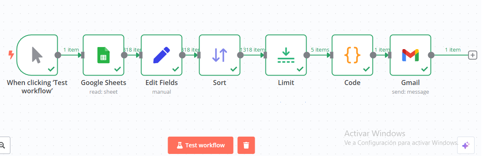

# Práctica de n8n
En este proyecto de práctica se realizó un sistema de prueba básico de recomendación de productos, con la finalidad de demostrar el aprendizaje en el uso de n8n para la orquestación de tareas. Los datos usados se obtuvieron de la página principal de D1 https://domicilios.tiendasd1.com/.

Primero se realizó la extracción de datos de los productos del sumermercado D1 utilizando python, se logró obtener la información más relevante mostrada en el frontend de la plataforma: nombre del producto, precio, peso, imagen, descripción y link de referencia; una vez obtenidos los datos se exportaron a un csv y posteriormente se cargaron en una hoja de Google Sheets: https://docs.google.com/spreadsheets/d/1kJcTPaGKKvz60V3syWTJCNn6qoDoSx5tAKplhP2XVKc/edit?usp=sharing.

Partiendo de los datos obtenidos se comenzó a realizar el flujo de trabajo, primero importando la hoja de cálculo de Google Sheets y realizando el filtrado de columnas, posteriormente se tomó una muestra aleatoria de cinco productos y se estandarizó un mensaje de promoción para finalmente enviarse por correo electrónico.

# Posibles mejoras

1. Para el propósito de la práctica los productos recomendados son aleatorios, pero podría basarse en una base de datos que recopile los productos adquiridos por diferentes usuarios.
2. En lugar de usar un mensaje de correo electrónico, podría elaborarse un chatbot que asista al usuario en la adquisición de productos basándose en la información extraída que podría estar en supabase o en alguna base de datos. Sin embargo no pude llevar a cabo esta idea por falta de conocimientos en la segregación de datos con la herramienta, lo que causaba errores en la consulta de los productos; para una pequeña cantidad de productos resultaba funcional usando un agente de IA.
3. En la API de la plataforma se podía extraer el número de unidades disponibles del producto, sería útil traer este dato para saber si la empresa cuenta con el stock suficiente.
